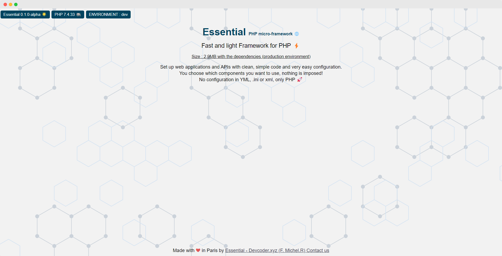

# Welcome to the Essential Framework

The Essential Framework is a versatile and lightweight PHP framework designed to simplify web development tasks. Whether you're building a small application or a complex web service, Essential Framework provides the tools and structure to help you get started quickly.

## Requirements

To use the Essential Framework, ensure that your development environment meets the following requirement:

- **PHP 7.4 or higher**: The Essential Framework requires PHP version 7.4 or later. You can check your PHP version by running `php -v` in your terminal.

Meeting this requirement is essential to work with the Essential Framework effectively. Please verify that your environment complies with this version of PHP before proceeding with your development.

## Quick Installation

To quickly set up a new project using the Essential Framework, you can use Composer. Open your terminal and run the following command:

```bash
composer create-project devcoder-xyz/essential-framework
```
This command will create a new Essential Framework project in a directory named "essential." It includes all the necessary files and dependencies to start your PHP web application development.

Once the installation is complete, you can proceed with configuring your project and start building your application using the Essential Framework.

This quick installation method simplifies the setup process and allows you to begin working on your project right away.

## Default Dependencies

The Essential Framework comes with several default PHP libraries and dependencies to help you build robust web applications. Below is a list of these default dependencies along with a brief description of their functionality:

- **[devcoder-xyz/php-event-dispatcher](https://packagist.org/packages/devcoder-xyz/php-event-dispatcher)**: This library provides an event dispatcher that allows you to implement the observer pattern in your application. It helps you manage and react to events within your application's lifecycle.

- **[devcoder-xyz/php-dependency-injection](https://packagist.org/packages/devcoder-xyz/php-dependency-injection)**: Dependency injection is a crucial design pattern for managing the dependencies of your classes. This library offers a powerful container for managing and injecting dependencies into your application components.

- **[devcoder-xyz/php-router](https://packagist.org/packages/devcoder-xyz/php-router)**: Routing is fundamental for defining how URLs map to controllers and actions in your application. This router library simplifies route definition and URL routing, making it easier to handle HTTP requests.

- **[devcoder-xyz/php-logging](https://packagist.org/packages/devcoder-xyz/php-logging)**: Logging is essential for debugging and monitoring your application. This library provides a straightforward way to log messages, errors, and events in your application.

- **[devcoder-xyz/php-session](https://packagist.org/packages/devcoder-xyz/php-session)**: Session management is vital for preserving user data across multiple HTTP requests. This library simplifies session handling, making it easier to store and retrieve user-specific information.

- **[devcoder-xyz/php-flash](https://packagist.org/packages/devcoder-xyz/php-flash)**: Flash messages are a way to display temporary messages to users, such as success or error messages. This library assists in managing and displaying flash messages in your application.

- **[devcoder-xyz/php-renderer](https://packagist.org/packages/devcoder-xyz/php-renderer)**: Templating engines allow you to separate the presentation layer from the application logic. This library provides a simple template rendering engine for generating dynamic HTML content.

- **[devcoder-xyz/php-validator](https://packagist.org/packages/devcoder-xyz/php-validator)**: Data validation is crucial for ensuring that user input meets your application's requirements. This library provides validation tools and rules to validate data effectively.

- **[laminas/laminas-diactoros](https://packagist.org/packages/laminas/laminas-diactoros)**: Laminas Diactoros is a library for handling HTTP messages and PSR-7 compatibility. It provides essential classes and utilities for managing HTTP requests and responses in your application.

These default dependencies are included in your Essential Framework project to streamline common web development tasks. You can explore their documentation for more details on how to use them in your applications.

## Running a Local Web Server

### Using PHP's Built-in Server

To test your Essential Framework application locally, you can use PHP's built-in web server. Open your terminal and navigate to the project's root directory. Then, run the following command:

```bash
php -S localhost:8080 -t public/
```

This command starts a local web server using PHP on your localhost (127.0.0.1) and port 8080. The `-t` option sets the document root to the "public" directory of your project.

You can access your Essential Framework application in your web browser by visiting `http://localhost:8080`. This allows you to test your application and see it in action during development.

### Using Docker Compose

If you prefer to use Docker for local development, Essential Framework provides a Docker Compose configuration. Ensure you have Docker and Docker Compose installed on your system.

Before starting the Docker containers, make sure to customize the ports by editing your `.env` file. You can set the desired ports for PHP and Nginx using the following variables:

```dotenv
# .env

DOCKER_PORT_PHP=9008
DOCKER_PORT_NGINX=8081
```

After configuring the ports, you can start the Docker containers using the following command:

```bash
docker compose up -d
```

This command reads the configuration from the `docker-compose.yml` file and launches the PHP and Nginx containers. You can then access your application in a web browser at `http://localhost:8081`.

Choose the method that best suits your development environment and preferences for running the Essential Framework locally.



## Project Structure

The Essential Framework follows a structured directory layout to help you organize your application code, configuration, and other assets efficiently. Below is an overview of the project's directory structure:

```plaintext
├── bin
│   └── console
│
├── config
│   ├── commands.php
│   ├── framework.php
│   ├── listeners.php
│   ├── middleware.php
│   ├── packages.php
│   ├── parameters.php
│   ├── routes.php
│   └── services.php
│
├── public
│   └── index.php
│
├── src
│   ├── Controller
│   │   ├── ApiController.php
│   │   └── MainController.php
│   ├── Event
│   │   └── ExampleEvent.php
│   ├── Listeners
│   │   └── ExampleListener.php
│   └── Kernel.php
│
├── templates
│   ├── _exception
│   │   └── error.html.php
│   └── welcome.html.php
│
├── tests
│
├── var
│   ├── cache
│   └── log
│       ├── dev.log
│       └── prod.log
│
├── LICENSE
├── README.md
├── composer.json
├── composer.lock
└── docker-compose.yml
```

Here's a breakdown of the main directories and their purposes:

- **bin**: This directory contains the `console` script, which serves as the entry point for running command-line tasks and artisan commands in your application.

- **config**: Configuration files for your application are stored here. These files define various aspects of your application, such as routes, services, middleware, and more. The `framework.php` file is a crucial configuration file for the Essential Framework.

- **public**: The web server's document root should be set to this directory. It contains the `index.php` file, which is the entry point for incoming HTTP requests.

- **src**: This is where your application's source code resides. The `Controller` directory holds your controllers, while the `Event` and `Listeners` directories are for event handling. The `Kernel.php` file is the heart of your application, responsible for bootstrapping and configuration.

- **templates**: This directory stores your application's templates or views. The `_exception` subdirectory is used for error pages, while other templates can be organized based on your application's needs.

- **tests**: You can place your PHPUnit test cases and testing-related code in this directory.

- **var**: Application-generated files, such as cached data and logs, are stored here. The `cache` directory holds cached data, while the `log` directory stores log files. Logs can be categorized based on the environment, such as `dev.log` for development and `prod.log` for production.

- **docker-compose.yml**: If you're using Docker for local development, this file defines your project's Docker containers and services.

This structured layout helps you keep your project organized and maintainable as it grows. You can customize and expand each directory to suit your application's requirements.

# First HTTP Route

Let's get started by exploring the first HTTP route defined in the Essential Framework. By default, there are two routes configured: one for the main page and another for the API. In this section, we'll focus on the route for the main page.

## Accessing the Main Page

To access the main page of your application, open your web browser and navigate to the root URL, which is `'/'`. For example: http://localhost:8080/


When you visit this URL, the Essential Framework's routing system will direct the request to the `MainController` class, specifically to a method that handles this route.

## Exploring the MainController

The `MainController` is a PHP class responsible for processing requests related to your application's main page. It contains methods that respond to different HTTP requests and return appropriate responses.

Here's a simple example of a `MainController` method that responds to a GET request:

```php
use Psr\Http\Message\ResponseInterface;
use Psr\Http\Message\ServerRequestInterface;

class MainController
{
    public function __invoke(ServerRequestInterface $request): ResponseInterface
    {
        // Your application logic goes here
        // You can generate HTML, retrieve data, and return a response

        // For demonstration purposes, let's return a basic HTML response
        return response('<h1>Welcome to the Essential Framework!</h1>');
    }
}
```
This `__invoke` method handles requests to the root URL. It generates an HTML response with a simple welcome message.

## Try It Out

1. Ensure that your Essential Framework application is running. You can use the built-in PHP server or Docker, as explained in the [Quick Installation](#quick-installation) section of this README.

2. Open your web browser and navigate to the root URL:

```
http://localhost:8080/
```

3. You should see the "Welcome to the Essential Framework!" message generated by the `MainController`.

Congratulations! You've successfully accessed your first HTTP route in the Essential Framework. You can further customize and extend the `MainController` to build your web application's main page.

# Framework Documentation

For more in-depth information and details about using the Essential Framework, please refer to the following documentation sections:

1. [Configuration](framework-doc/configuration.md): Learn about configuring your Essential Framework application, including using the `.env` file and customizing parameters.

2. [Controllers](framework-doc/controllers.md): Explore how to create and work with controllers in the Essential Framework.

3. [Events](framework-doc/events.md): Understand how to implement event-driven architecture in your application.

4. [Flash Messages](framework-doc/flash.md): Learn about displaying flash messages to users in your application.

5. [Logging](framework-doc/logging.md): Discover how to use the default logging library or customize it with your preferred PSR-3 compatible library.

6. [Middleware](framework-doc/middleware.md): Learn how to create and use middleware to process HTTP requests and responses.

7. [Routing](framework-doc/routing.md): Explore the routing system and define routes for your application.

8. [Services](framework-doc/services.md): Understand how to manage services and dependencies using the container.

9. [Session Management](framework-doc/session.md): Learn about session management and how to work with sessions in your application.

10. [Templates](framework-doc/templates.md): Discover how to use templates to separate the presentation layer from your application's logic.

11. [Validation](framework-doc/validation.md): Learn about data validation and how to use validation tools in your application.

12. [Commands](framework-doc/commands.md): Explore how to create, manage, and execute commands in your Essential Framework application using Symfony Console.

13. [My Custom Package](framework-doc/packages.md): Create and activate custom Essential packages to extend your project's functionality.
